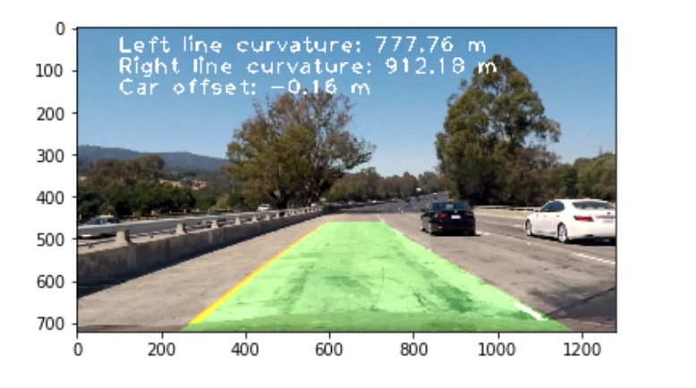

#### A **warm welcome** to you on my Github page.
#### In the following, I will shortly introduce you to my most exciting projects.

This site gives you a short introduction to my work and is used to introduce myself online. For Think.Make.Start. I decided to give you a link to this site instead of my LinkedIn as it gives you deeper insights into my technical skills, my motivation and provides a chance to get to know me more personal online. 

## Projects

### 1. [Behaviour Cloning with Convolutional Neural Networks in Simulation (Click here to find out more)](https://github.com/VinzenzTrimborn/Behavioral-Cloning)

### 2. [Lane Line Detection (Click here to find out more)](https://github.com/VinzenzTrimborn/AdvancedLaneLines)

### 3. My ROS Code on a REAL Self-Driving-CAR
In the end, I had the change to even upload my ROS code on a self-driving car and to let it drive around based on waypoints in a parking lot.

1. Check it out on my [YouTube](https://youtu.be/89S7Zg-x7hw) (it sadly did not recogize the red light.)

2. Check out my [Code](https://github.com/VinzenzTrimborn/CarND-Capstone)

### 4. KINEXON IoT Product Management Industrie Team
After my studies at NTU, which were mostly based on Simulation and Business, I got an Internship at [KINEXON](https://kinexon.com) one of the most exciting IoT Companies in Munich. I worked as part of the Product Management Industrie Team, where I gained a lot of insights into the production industry. I learned a lot about the requirements and technical standards and found out that even small innovations have gigant potential in the industry.

During that time a built a software prototype which might be rolled out within the next year as part of a new product. I can not share details but if it is rolled out its going to be a part of this [product](https://kinexon.com/de/robotik). 

### 5. A small social startup: Check [Waterfilter](https://waterfilter.care) out.
Last I want to mention a social project. Before I got deeply involved into tech I managed a social student startup, which currencly produces water filters in Kasulu Tanzania. Launched out of the student club Enactus, we were a group of around 8 students and built up a small manufactory in Kasulu, recplacing an older smaller one in Kigoma. Initally, it was our plan to have a self-sustainable business model. However this did not work out and so most of the more than 250 distributed filters are donation based. However, they help more than 1000 people to get the access to safe drinking water.

Check [Waterfilter](https://waterfilter.care) out.

Check out this [Video](https://youtu.be/ZnzhbFvt4kU) to get inisght into project in Tanzania (2 years ago).

## Motivation
Overall, I am mostly motivated about one thing. Motivate people to make the world a bit better by using the amazing technologies and knowledge that are now accessible for humankind. 

Here are some videos which just made me smile and motivate me to become an engineer. I hope to have amazing 2 weeks with you. 

1. [Homade Electric Airplane](https://www.youtube.com/watch?v=hp7JcmwKQcU&t=743s)
2. [Punch Flamethrower](https://www.youtube.com/watch?v=GS9A1JuOKE8)
3. [Lightsaber](https://www.youtube.com/watch?v=xC6J4T_hUKg)
4. [Overengineering](https://www.youtube.com/watch?v=h4T_LlK1VE4)

## Learn More
1. You can even gather more Info about me on [LinkedIn](https://www.linkedin.com/in/vinzenz-trimborn)
2. Our look at more [GitHub Projects](https://github.com/VinzenzTrimborn)
