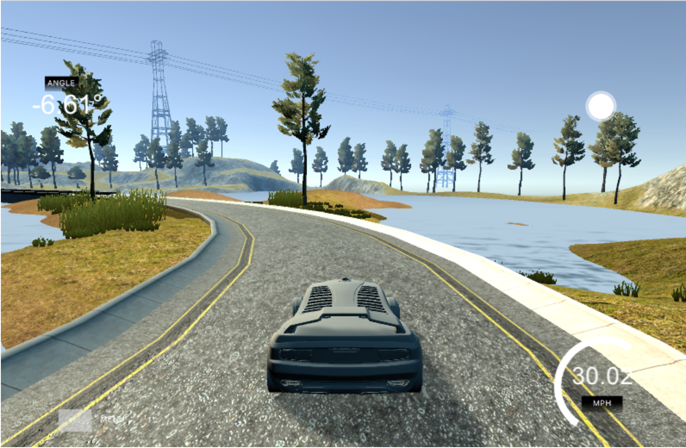
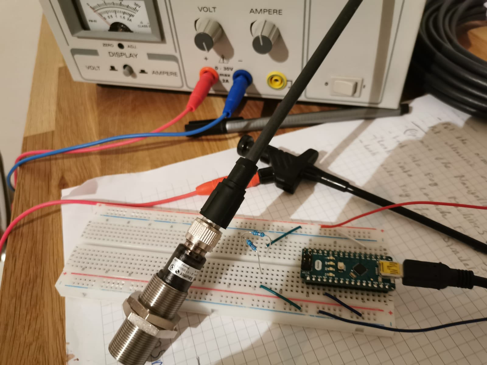
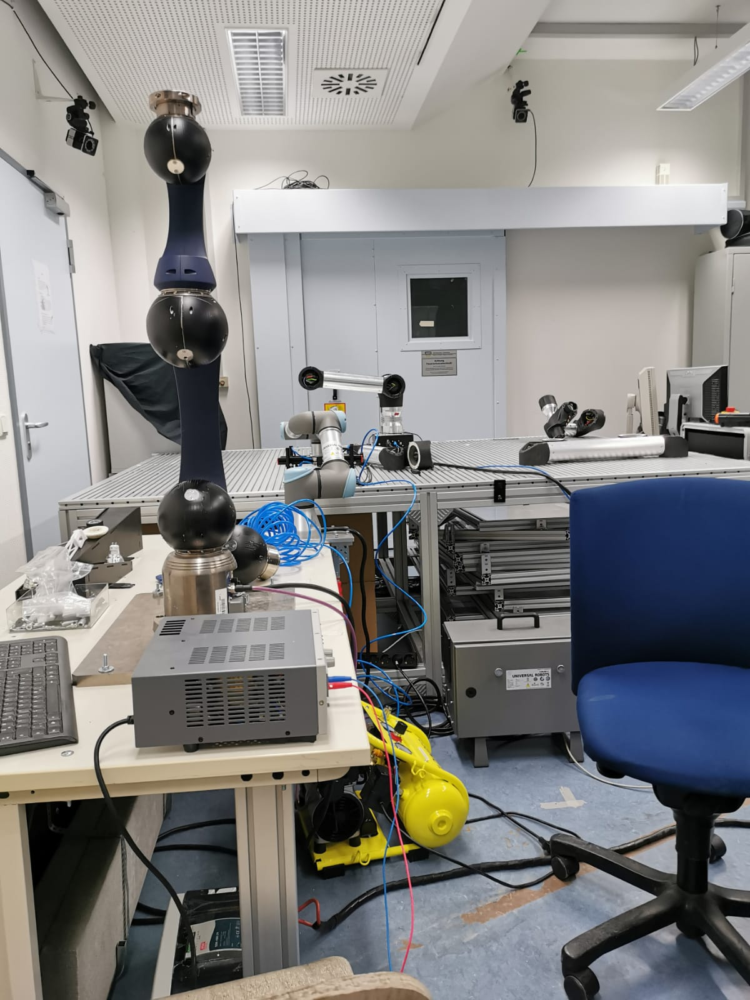
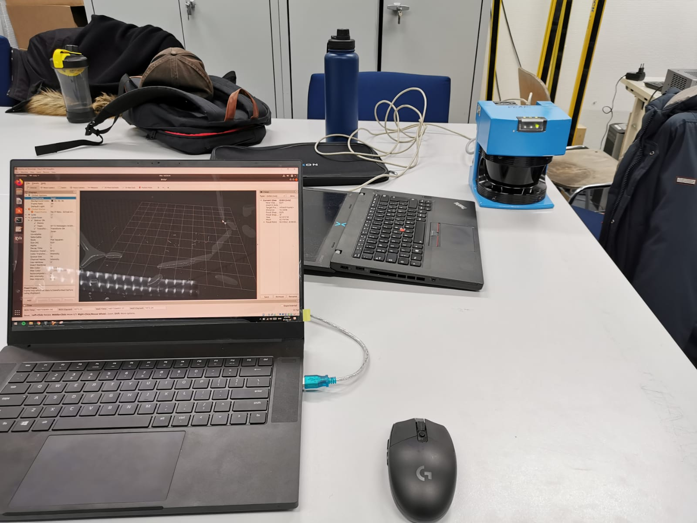

# Think.Make.Start.

#### A **warm welcome** to you on my Github page. 

This Repository/Site gives you a short introduction to my work and is used to introduce myself online. For Think.Make.Start. I decided to give you a link to this site instead of my LinkedIn as it gives you deeper insights into my technical skills, my motivation and provides a chance to get to know me more personal online. 

In the following, I will shortly introduce you to my most exciting projects. After that, I will quickly describe what I am overall excited about so that hopefully you can get to know me online as best as possible. 

## Projects

I began teaching myself and trying out things besides university in Mid 2019 after my 4th bachelors semester. I took 4 months off from university before my exchange semester to Singapur/NTU to learn about **autonomous driving cars** online. 

Since an autonomous car is a robot, I did some projects concerning ROS (Robot Operating System) and CNNs (Convolutional Neural Networks), with which I trained a car to steer correctly in a simulator based on the pictures of the road. Moreover, I did projects recognizing Traffic Signs with a CNN and fundamental principals of computer vision.

All in all I learn a lot of the fundamentals of robotics. Here you can check out the most exiting projects I did.

### 1. [Behaviour Cloning with Convolutional Neural Networks in Simulation (Click here to find out more)](https://github.com/VinzenzTrimborn/Behavioral-Cloning)

### 2. [Traffic Sign Classifier (Click here to find out more)](https://github.com/VinzenzTrimborn/TrafficSignClassifier)

### 3. My ROS Code on a REAL Self-Driving-CAR
In the end, I had the change to even upload my ROS code on a self-driving car and to let it drive around based on waypoints in a parking lot.

1. Check it out on my [YouTube](https://youtu.be/89S7Zg-x7hw) (it sadly did not recogize the red light.)

2. Check ou my [Code](https://github.com/VinzenzTrimborn/CarND-Capstone)

### 4. IoT Product Management Industrie Team
After my studies at NTU, which were mostly based on Simulation and Business, I got an Internship at [KINEXON](https://kinexon.com) one of the most exciting IoT Companies in Munich. I worked as part of the Product Management Industrie Team, where I gained a lot of insights into the production industry. I learned a lot about the requirements and technical standards and the potential Industrie 4.0 has.

During that time a built a software prototype which might be rolled out within the next year as part of a new product. I can not share details but if it is rolled out its going to be a part of this [product](https://kinexon.com/de/robotik). 

### 5. Modular Robotics
After gaining so many insight into the automation industry, I decided to dive deeper into hardware instead of Information Systems (my current Study program) and applied for a Modular Robotics Masters project. Currently, we are testing robots/sensors, to automate the difficult task of concrete removal in the construction industry.

  

In the left picture, you see an image of an ultrasonic sensor connected to an Arduino microcontroller to retrieve sensor data from it and into ROS. IN the middle you see the robot arm which is used to remove the concrete (it will hold a high pressure water gun). On the right you can see a Lidar connected to a computer to visulaize obstacles around the sensor in 2D.

### 6. Check [Waterfilter](https://waterfilter.care) out.
Last I want to mention a social project. Before I got deeply involved into tech I managed a social student startup, which currencly produces water filters in Kasulu Tanzania. Lounched out of the student club Enactus, we were a group of around 8 students and built up a small manufactory in Kasulu. Initally, it was our plan to have a self-sustainable business model. However this did not work out and so most of the more than 250 distributed filters are donation based. However, they help more than 1000 people to get the access to safe drinking water.

Check [Waterfilter](https://waterfilter.care) out.

Check out this [Video]() to get inisght into project in Tanzania (2 years ago).

## Motivation
Overall, I am mostly motivated about one thing. Motivate people to make the world a bit better by using the amazing technologies and knowledge that are now accessible for humankind. 

Here are some videos which just made me smile and motivate me to become an engineer. 

1. [Homade Electric Airplane](https://www.youtube.com/watch?v=hp7JcmwKQcU&t=743s)
2. [Punch Flamethrower](https://www.youtube.com/watch?v=GS9A1JuOKE8)
3. [Lightsaber](https://www.youtube.com/watch?v=xC6J4T_hUKg)
4. [Overengineering](https://www.youtube.com/watch?v=h4T_LlK1VE4)

You should not watch them, if you still have work to do as they really distracted me.

## Learn More
1. You can even gather more Info about me on [LinkedIn](https://www.linkedin.com/in/vinzenz-trimborn)
2. Our look at more [GitHub Projects](https://github.com/VinzenzTrimborn)
